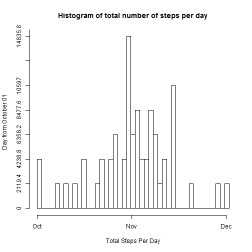

## Project Assignment for Week 2 of Reproducible Research

### Load the data:


```r
FILENAME      <- "activity.csv"
ACTIVITIES_DT <- read.csv(FILENAME, na.strings=c("NA"))
```

---

Once loaded we can do a quick check about the data

```r
summary(ACTIVITIES_DT)
```

```
##      steps                date          interval     
##  Min.   :  0.00   2012-10-01:  288   Min.   :   0.0  
##  1st Qu.:  0.00   2012-10-02:  288   1st Qu.: 588.8  
##  Median :  0.00   2012-10-03:  288   Median :1177.5  
##  Mean   : 37.38   2012-10-04:  288   Mean   :1177.5  
##  3rd Qu.: 12.00   2012-10-05:  288   3rd Qu.:1766.2  
##  Max.   :806.00   2012-10-06:  288   Max.   :2355.0  
##  NA's   :2304     (Other)   :15840
```

### What is the mean total number of steps taken per day?
####1. Calculate the total steps per day: 


```r
# using the aggregate function to group and sum by date
total_steps_per_date <- aggregate(steps ~ date, data=ACTIVITIES_DT, FUN=sum)
```
####2. Histogram of the total number of steps taken each day

```r
# Now the data is ready to be plotted, lets do this calling hist
# by the way, the difference between barplot and histogram is that a barplot bars represent
# different categories whilst a histogram bars represent the same category
hist(total_steps_per_date$steps, xlab="Total Steps Per Day", ylab="Day from October 01", breaks=nrow(total_steps_per_date), axes=FALSE, main="Histogram of total number of steps per day")

axis(side=1, at=seq(0,max(total_steps_per_date$steps), max(total_steps_per_date$steps)/2), labels=c("Oct", "Nov", "Dec"))
axis(side=2, at=seq(0,10, 1), labels=seq(0,max(total_steps_per_date$steps), max(total_steps_per_date$steps)/10))
```



As shown in the graphic plot above, it is clearly seen that November was the month were more steps were measured. 

####3. Mean and median of the total number of steps taken per day
The summary function shows both required values, anyway let's get them using corresponding functions:
- Mean =

```r
mean(total_steps_per_date$steps)
```

```
## [1] 10766.19
```
- Median =

```r
median(total_steps_per_date$steps)
```

```
## [1] 10765
```

### What is the average daily activity pattern?

####1.Plot of the 5-minute interval and the average number of steps taken

```r
average_steps_per_day <- aggregate(interval ~ steps, data=ACTIVITIES_DT, FUN=mean)
plot(average_steps_per_day$steps, average_steps_per_day$interval, type="l", ylab="Average steps by interval", xlab="5-minute interval")
```


The graphic plot above shows that between interval [500,1000] the max value of steps is reached.
To have the exact number, let's get the maximun number of steps:

```r
average_steps_per_day[average_steps_per_day$steps==max(average_steps_per_day$steps),]
```

```
##     steps interval
## 617   806      615
```

### Imputing missing values

####1.Total number of missing (NAs) values:

```r
length(ACTIVITIES_DT[is.na(ACTIVITIES_DT$steps), 1])
```

```
## [1] 2304
```
####2. Devise a mechanism to fill in NA values
By examining the data it is easy to note that all missins (NA) values belong to full days, so
it won't be possible to get a mean/median value for those, as shown below:

```r
# Get the dates where NA values are present
dates.na.values <- unique(with(ACTIVITIES_DT, date[is.na(steps)]))

# Check whether it is possible to calculate a mean/median from extracted data:
ACTIVITIES_DT[ACTIVITIES_DT$date %in% dates.na.values & !is.na(ACTIVITIES_DT$steps), 1]
```

```
## integer(0)
```

```r
# With NA dates, calculate the mean
mean(ACTIVITIES_DT[ACTIVITIES_DT$date %in% dates.na.values, 1])
```

```
## [1] NA
```

####3. Let's use the mean for the 5-minute interval instead:

```r
ACTIVITIES_DT.NONA  <- ACTIVITIES_DT
mean.5min.interval  <- mean(ACTIVITIES_DT[ACTIVITIES_DT$date %in% dates.na.values, 3])
ACTIVITIES_DT.NONA[is.na(ACTIVITIES_DT.NONA$steps), 1] <- mean.5min.interval
```

Now let's repeat the histogram to compare the results with this new dataset (ACTIVITIES_DT.NONA)

####4. Histogram of the total number of steps taken each day

```r
total_steps_per_date.nona <- aggregate(steps ~ date, data=ACTIVITIES_DT.NONA, FUN=sum)

hist(total_steps_per_date.nona$steps, xlab="Total Steps Per Day", ylab="Day from October 01", breaks=nrow(total_steps_per_date), axes=FALSE, main="Histogram of total number of steps per day NO NAs")

axis(side=1, at=seq(0,max(total_steps_per_date.nona$steps), max(total_steps_per_date.nona$steps)/2), labels=c("Oct", "Nov", "Dec"))
axis(side=2, at=seq(0,10, 1), labels=seq(0,max(total_steps_per_date.nona$steps), max(total_steps_per_date.nona$steps)/10))
```


```r
mean(total_steps_per_date.nona$steps)
```

```
## [1] 53828.98
```
- Median =

```r
median(total_steps_per_date.nona$steps)
```

```
## [1] 11458
```

Clearle it can be seen that introduced values to replace NAs alter the results of the plotting, mean and median. If the value introduced is close to the original median/mean, then the plots behave in the same way. But if the value moves closer to the limits [min(total steps), max(total steps)], then the histogram bars agglomerate arount October, where less NA values were recorded. Interesting!

### Are there differences in activity patterns between weekdays and weekends?

```r
ACTIVITIES_DT.NONA$date <- as.Date(ACTIVITIES_DT.NONA$date,"%Y-%m-%d")
weekenddays <- c("Saturday","Sunday")
ACTIVITIES_DT.NONA$wday = factor((weekdays(ACTIVITIES_DT.NONA$date) %in% weekenddays), levels=c(TRUE, FALSE), labels=c("weekend","weekday"))
```

####1.Plot of the 5-minute interval and the average number of steps taken

```r
library(ggplot2)
```


```r
ave_steps_weekend <- aggregate(interval ~ steps, data=subset(ACTIVITIES_DT.NONA, wday=="weekend"), FUN=mean)

ave_steps_weekday <- aggregate(interval ~ steps, data=subset(ACTIVITIES_DT.NONA, wday=="weekday"), FUN=mean)

par(mfrow=c(2,1), oma=c(2,2,2,2))
plot(ave_steps_weekend$steps, ave_steps_weekend$interval, type="l", main="weekend", xlab="", ylab="")

plot(ave_steps_weekday$steps, ave_steps_weekday$interval, type="l", main="weekday", xlab="",ylab="")

mtext(c("Interval", "Number of Steps"),c(SOUTH<-1, WEST<-2),line=0.4, cex=1.2, col="black", outer=TRUE)
```


The graphic plot above shows that between interval [500,1000] the max value of steps is reached.
To have the exact number, let's get the maximun number of steps:


```r
average_steps_per_day[average_steps_per_day$steps==max(average_steps_per_day$steps),]
```

```
##     steps interval
## 617   806      615
```

